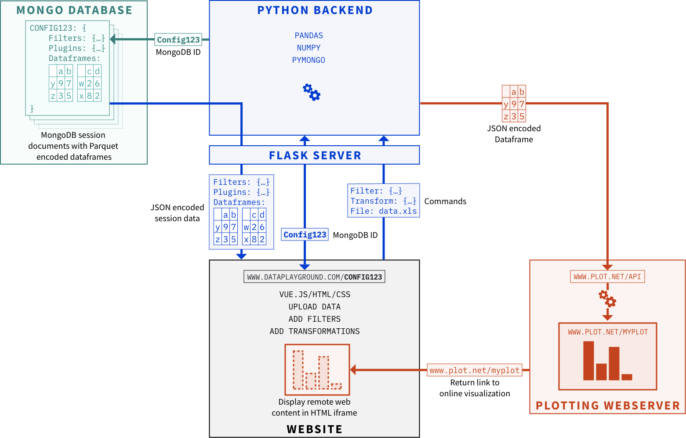

# Micromix user guide

## Contents
- [Micromix](#micromix)
- [Installing and running](installing_running.md)
    - [Using pre-built AWS container](#using-pre-built-aws-container)
    - [Local install](#local-install)
        - [Website](#website)
        - [Heatmap](#heatmap)
- [Using Micromix](#using-micromix)
- [Modifying Micromix](#modifying-micromix)
    - [How to add a new organism](#how-to-add-a-new-organism)
    - [How to update gene or pathway annotations](#how-to-update-gene-or-pathway-annotations)
    - [Generating new annotations](#generating-new-annotations)
    - [Adding new visualisation plugins](#adding-new-visualisation-plugins)


<br><br>


# Micromix

## Background
Micromix was designed as a visualisation platform to easily view next generation sequencing data, such as counts from RNA-seq. Its main focus is for use with prokaryotic data, such as bacteria, which comes pre-bundled. Different bacteria can be included where the associated data can be filtered and/or transformed, then passed through a visualisation tool to examine biological patterns further, such as a heatmap.


## Infrastructure
The site contains a backend (Flask) and frontend (Vue.js) that communicate with each other, saving data from each session using MongoDB. Plugins within the site are typically setup on separate servers with data being passed and a visualisation returned and displayed within the site.
Since each user session is stored with a unique ID, session information can be re-loaded by passing the unique ID into the URL. For example: http://micromix.com?config=63ec9a4be1ea830ca6249f46. These types of links can also be shared to collaborators so they can examine specific data patterns from data within the site, or unique user data they have manually uploaded.

<br>
<br>




# Installing and running Micromix

There are three options to use Micromix, depending on the user requirements.

## Using pre-built AWS container

The simplest way to use Micromix is to use our pre-built container. This is available on AWS here: **[ << insert hyperlink >> ]**, as a downloadable virtual image that can be loaded with tools such as VirtualBox. Alternatively, the container can also be directly used with AWS services and loaded within the browser.
Once loaded, the site can be accessed by opening the browser and typing **localhost:8000**

**<< image to be inserted >>**

## Running locally or on a server

### **Website**
There are a number of requirements if running locally or on a server for the first time. 

**Step 1:** Download the git repository: 
```bash
#install Git
sudo apt-get install git

#Download micromix files from GitHub
git clone www.site.com 
```  

**Step 2:** Install required software and run:


**MongoDB:**

As previously discussed, the site stores the underlying data and user session data within MongoDB, and needs to be running in the background.

```bash
#Install MongoDB
sudo apt install -y mongodb

#Confirm it is running
sudo systemctl status mongodb

#if not, then start with
sudo systemctl start mongodb
```


**The website backend:**

```bash
sudo apt update
sudo apt install python3-pip
pip3 install wheel
#to allow virtual env (check python version first)
sudo apt-get install python3.8-venv 

#change to backend
cd Micromix/Website/backend

#create python virtual environment
python3 -m venv venv
#Enter the environment
source venv/bin/activate

#install the required python libraries
pip3 install -r requirements.txt

#enable debugging (optional)
export FLASK_DEBUG=1

#Launch Flask server
flask run --port 3000

#you should see the following output
```
**<< image to be inserted FLASK running >>**


**The website frontend:**
```bash
#Change to the frontend
cd Micromix/Website/frontend

#Make sure dependencies are already installed
sudo apt-get install gcc g++ make

#Download and install Node.js
sudo apt install curl
curl -sL https://deb.nodesource.com/setup_18.x -o nodejs_setup.sh
#change permissions
sudo chmod 777 nodejs_setup.sh
#run
sudo ./nodejs_setup.sh
#install
sudo apt-get install -y nodejs

#Install vue-cli with Node Package Manager (npm)
sudo npm install -g @vue/cli

#install Eslint and axios
npm install --save-dev eslint eslint-plugin-vue
npm i axios

#initialise ESLint
./node_modules/.bin/eslint --init

#Use these responses
✔ How would you like to use ESLint? · "To check syntax and find problems"
✔ What type of modules does your project use? · "syntax and markup" #default option
✔ Which framework does your project use? · "vue"
✔ Does your project use TypeScript? · "No"
✔ Where does your code run? · "browser"
✔ What format do you want your config file to be in? · "JavaScript"
The config that youve selected requires the following dependencies:

eslint-plugin-vue@latest
✔ Would you like to install them now with npm? · "Yes"
Installing eslint-plugin-vue@latest

#This creates a file called .eslintrc.js

#You will need to modify this file in 2 places
#1) Comment out the line below to avoid an error about process not being defined (or similar)

vim .eslintrc.js

    "extends": [
        //"eslint:recommended",  //comment this line
        "plugin:vue/essential"

#2) Add a rule to allow multi-word component names
"rules": {
        'vue/multi-word-component-names': 'off',
    }

#Finally, we can install node dependencies
npm install

#Launch frontend
npm run serve

#you should see the following output
```
> Open the address shown in the terminal where you executed the line above with your web browser. This should be http://localhost:8080/. The backend should also be running, otherwise the site will not load.

**<< image to be inserted - frontend running >>**


> At this point, the site will be functional and users can browse datasets, apply filters and use available plugins, apart from the Heatmap - which requires further installation.

**<< image to be inserted - Site working >>**


### **Heatmap**
There are a number of requirements if running locally or on a server for the first time. The heatmap follows the same infrastructure that the main site does: there is a frontend and backend, which then communicate through a specified port where the resulting heatmap can be displayed within the site when clicking on the heatmap button.

> Note: <br> Before running the heatmap, there should already be two terminals open. These will be the website backend (terminal) and the website frontend (terminal). The heatmap will require two additional terminals to be open for the respective frontend and backend. 


**Step 1:** Prepare the heatmap backend: 
```bash 
#Browse to the backend
cd Micromix/Heatmap/backend

#create an additional python virtual environment
python3 -m venv venv2
#Enter the environment
source venv2/bin/activate

#install the required python libraries
pip3 install -r requirements.txt

#enable debugging (optional)
export FLASK_DEBUG=1

#Launch Flask server
flask run

#you should see the following output
```
**<< image to be inserted  - backend running HM>>**


**Step 1:** Prepare the heatmap frontend: 
```bash
#Change to the frontend
cd Micromix/Heatmap/frontend

#Install node dependencies
npm install

#Launch frontend
npm run serve

#you should see the following output
```
**<< image to be inserted >>**

> You should now be able to browse the site and use the heatmap visualisation plugin

<br>

# Modifying Micromix

Depending on the way you have configured or downloaded Micromix, when making changes, the frontend or backend (or both) may require restarting before the changes are visable.

If using the pre-configured image, you will have to restart the underlying service.

```bash
#Website
restart website-backend service
restart website-frontend service

#Heatmap
restart heatmap-backend service
restart heatmap-frontend service
```

If you have pre-compiled yourself, you only need to press `Control + C` to stop the service in the relevant terminal, then press the up arrow to find the previous command followed by `Enter`


## Preparing a new bacteria

Micromix can be used with any desired bacteria. Once a bacteria has been chosen, you will need to download and prepare some common files.
Here is a brief summary:

**Step 1:** download files

**Step 2:** Create transcriptome

**Step 3:** Create eggnog annotations

**Step 4:** Run script to generate .json files for micromix


In this example, we will use `Salmonella typhimurium SL1344`

**Step 1:**

Download the genome (.fasta or .fa) and genome annotation (.gff or .gtf).

For this example, you can use the following:

```bash
#GFF
curl https://ftp.ensemblgenomes.ebi.ac.uk/pub/bacteria/release-56/gff3/bacteria_79_collection/salmonella_enterica_subsp_enterica_serovar_typhimurium_str_sl1344_gca_000210855/Salmonella_enterica_subsp_enterica_serovar_typhimurium_str_sl1344_gca_000210855.ASM21085v2.56.chromosome.Chromosome.gff3.gz -o salmonella_sl1344.gff3.gz

#Fasta
curl https://ftp.ensemblgenomes.ebi.ac.uk/pub/bacteria/release-56/fasta/bacteria_79_collection/salmonella_enterica_subsp_enterica_serovar_typhimurium_str_sl1344_gca_000210855/dna/Salmonella_enterica_subsp_enterica_serovar_typhimurium_str_sl1344_gca_000210855.ASM21085v2.dna.chromosome.Chromosome.fa.gz -o salmonella_sl1344.fa.gz

#unzip
gunzip salmonella_sl1344.gff3.gz
gunzip salmonella_sl1344.fa.gz
```

**Step 2:**

Generate a bacterial transcriptome. This is required to upload to eggNOG-mapper [REF], which will provide annotations, including gene description, KEGG pathways, Gene Ontologies etc.

To get a summary of the features within your .gff file, you can run this command:

```bash
awk -F '\t' '{print $3}' salmonella_sl1344.gff3 | sort | uniq -c
```

This will display something similar to this:

```bash
awk -F '\t' '{print $3}' salmonella_sl1344.gff3 | sort | uniq -c
   4622 
    129 biological_region
   4466 CDS
      1 chromosome
   4636 exon
   4462 gene
   4462 mRNA
    113 ncRNA
    113 ncRNA_gene
     40 pseudogene
     40 pseudogenic_transcript
```

To generate the transcriptome, we need to know what features we would like to use. For example, we may only want to look at CDS regions, or we may want to look at a wider range of features as shown:

```bash
#The generate_transcriptome.py script is located here:
/folder/generate_transcriptome.py

#T view the help menu
./generate_transcriptome.py -h

#To run, select the feature (CDS etc), and also the gene ID type. If available, we recommend using a tag that exists for each loci such as a locus tag (sl1344_0001), so un-named and hypothetical genes will be included. You will need to open the .gff file to identify what fields are available (alternatives are gene_id, ID, Name etc).
generate_transcriptome.py \
-fasta salmonella_sl1344.fa \
-gff salmonella_sl1344.gff3 \
-f ["CDS", "ncRNA", "pseudogene"] -a gene_id \
-o salmonella_sl1344.fa
```

> Note: Bacterial genome annotations (.gff/.gtf) can be challenging to work with due to non-uniformity, duplicate gene names and many other issues. You may receive an error message saying that some genes are duplicated, and thus a transcriptome couldn't be created. If this happens, open the .gff file and manually change the locus_tags. For example, if there are multiple SL1344_0010, change to SL1344_0010a and SL1344_0010b, then re-run.

**Step 3:**

You can now upload your transcriptome to eggNOG by browsing to `http://eggnog-mapper.embl.de/`. Select **CDS** as shown, then upload your transcriptome **upload sequences**.
Enter your **email address** and **submit** the job. You will receive an email that you need to click on, which will take you back to their site where you can start your job **Start job**.

**<< image to be inserted >>**

After a short time, you will receive another email providing a download link. 
[download xxx files], this is the file that is used in the next step.


**Step 4:**

The last step is extracting out the required information from the eggNOG output and saving to a compatible format for Micromix (.json files)

To do this, you will need to run the following

```bash
#The script is located here 
/folder/script.R

#R will need to be installed on your machine for this to execute successfully

#The resulting output files will be saved in the current directory
./scripr.R eggnog.xxx

#After running, you should have the following two files:
genes.json
pathways.json
```

## How to add a new organism

The corresponding file should then be added as an entry to datasets.json
```
b-theta/website/frontend/src/assets/json/organisms.json

```
Here we have added **Bacteria B** with the corresponding tags:

`"name":` - The name of the bacteria (displayed on button)

`"description":` - The description (displayed on button)

`"path":` - This automatically points to `b-theta/website/frontend/src/assets/organisms/`. You should copy the default folder and rename to your new bacterial name. Within this folder is an icon you can update which is displayed on the button. You can also adit the file `filters.json` to add/modify/create custom filters (discussed below in more detail in the section **[xxx]**).

`"id":` - this is a string and hex numbers that should be unique for each bacteria

`"datasets":` - should link to an entry in this file: `b-theta/website/frontend/src/assets/json/datasets.json`. 


```json
{
  "items": {

    "Bacteria A": {
      "name": "Bacteria A",
      "description": "Manually select datasets.",
      "path": "/bacteriaA",
      "id": "bacteria-a-e2ad6b25-40cb-4594-8685-f4fcb3ceb0e7",
      "datasets": ["Bacteria A RNA-seq"]
    },
    "Bacteria B": {
      "name": "Bacteria B",
      "description": "Manually select datasets.",
      "path": "/BacteriaB",
      "id": "bacteria-a-e2ad6b25-40cb-4594-8685-f4fcb3ceb0e8",
      "datasets": ["Bacteria B RNA-seq"]
    }
  }
}
```
> After adding new organism, you will need to link it to the  expression data - see the next section


## How to add new expression data

###### not just expression data - other related data types include:::

Expression files should be saved here:

```
b-theta/website/backend/static/new_expression.tsv
```

The corresponding file should then be added as an entry to datasets.json
```
b-theta/website/frontend/src/assets/json/datasets.json

```

Each new entry requires all the fields presented here, such as `text`, `value` and `separator`. The new entry here is called **New dataset** and is linked to the file **new_data.tsv** that should have previously been saved.

Here is a brief description of the file contents:

`"Micromix RNA-seq":` - The is the bold value that cannot be selected in the dropdown menu when selecting a new dataset

`"text": "Dataset 1" ` and `"text": "New dataset" ` - these are the names that will appear in the dropdown box that when selected will load expression data

`"value": ` - this contains the filename with the expression data, the delimiter and decimal character. 

The `columns` field should contain all columns within the associated file - here, this would be `dataset1.tsv`. If the column names do not match, an error will occur.

If you would not like to immediately show all columns, you can decide which columns should initially be displayed with `pre_selected_columns`. They can be re-added by the user when selecting the data and selecting `choose additional columns...`.  

```json
{
  "Bacteria A RNA-seq": {
    "label": "Bacteria A RNA-seq",
    "options": [
      {
        "text": "Dataset 1",
        "value": {"filename": "dataset1.tsv", 
                  "seperator": "\t", 
                  "decimal_character": ".", 
                  "columns": [{"value": null, "text": "All columns"}, "Sequence name", "locus tag", "Name", "Start", "End", "Strand", "Condition 1 logFC", "Condition 2 logFC"]},
        "seperator": "\t"
      },
      {
        "text": "New dataset",
        "value": {"filename": "new_data.tsv", 
                  "seperator": "\t", 
                  "decimal_character": ".", 
                  "columns": [{"value": null, "text": "All columns"}, "Sequence name", "locus tag", "Name" "Start", "End", "Strand", "Condition 1 logFC"], 
                  "pre_selected_columns": ["locus tag", "Name", "Condition 1 logFC"]},
        "seperator": "\t"
      }

    ]
  }
}
```
> After adding new expression data, both the frontend and backend will require a restart


## Modifying or adding gene or pathway annotations

#where to look

using a script linking eggnog...
```bash
Rscript parse_eggnog_annotations.R eggnog_annotation.tsv
```


## Adding new visualisation plugins

Buttons can do many things,
Link to a different API - clustergrammer
Link to website - jbrowse
Link to a custom API - heatmap

Info stored in [  ] and should be assigned a unique HEX number, such as xxx. 
Each plugin is stored in [  ]. Open the corresponding files to examine how information is parsed.


8.	How to deploy on a server and config files – nginx and gunicorn


To update gene annotations and pathways

Frontend
Src/assets/organisms/bacteroides/pathways.json
Src/assets/organisms/bacteroides/filters.json
Src/components/search_query.vue

Backend
Static/gene_annotations.json

