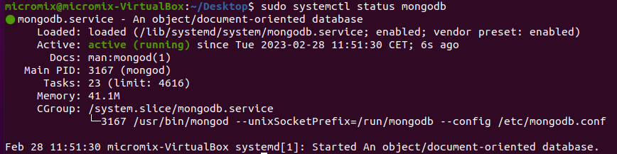
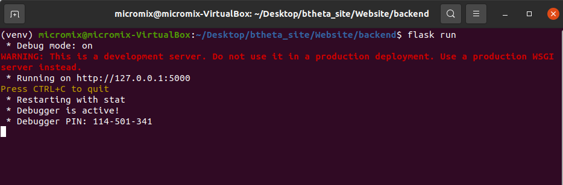
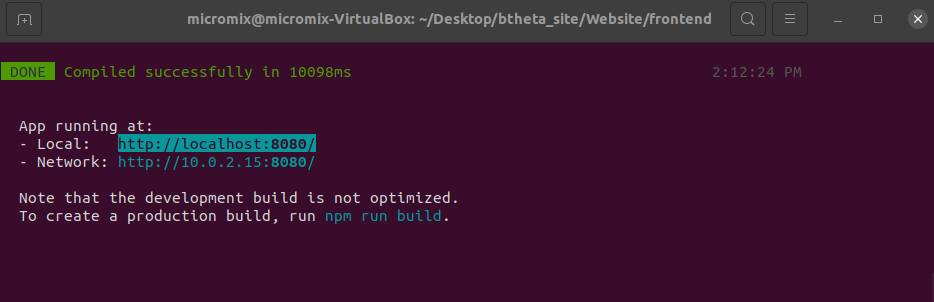
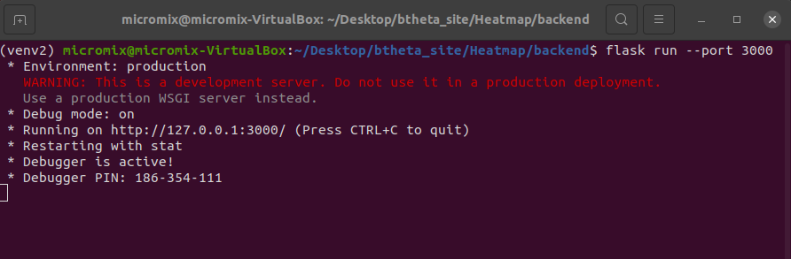
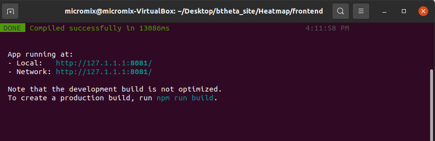

# Micromix user guide

## Contents
- [Micromix](README.md#micromix-user-guide)
- [Installing and running](installing_running.md#micromix-user-guide)
    - [Using pre-built AWS container](installing_running.md#1-using-pre-built-aws-container)
    - [Local install](installing_running.md#2-running-locally-or-on-a-server)
        - [Website](installing_running.md#website)
        - [Heatmap](installing_running.md#heatmap)
- [Using Micromix](using_micromix.md#micromix-user-guide)
    - [Selecting organism](using_micromix.md#selecting-organism)
    - [Filtering data](using_micromix.md#filtering-data)
    - [Visualising data](using_micromix.md#visualising-data)  
- [Modifying Micromix](modifying_micromix.md#micromix-user-guide)
    - [Preparing a new bacteria](modifying_micromix.md#preparing-a-new-bacteria)
    - [How to add a new organism](modifying_micromix.md#how-to-add-a-new-organism)
    - [How to add new expression data](modifying_micromix.md#how-to-add-new-expression-data)
    - [Modifying or adding gene or pathway annotations](modifying_micromix.md#modifying-or-adding-gene-or-pathway-annotations)
    - [Adding new visualisation plugins](modifying_micromix.md#adding-new-visualisation-plugins)


<br><br>


# Installing and running Micromix

There are two options to use Micromix, depending on the user requirements.

1) Using pre-built AWS container
2) Running locally or on a server

## 1. Using pre-built AWS container

The simplest way to use Micromix is to use our pre-built container. This is available on AWS here: **[ << insert hyperlink >> ]**, as a downloadable virtual image that can be loaded with tools such as VirtualBox. Alternatively, the container can also be directly used with AWS services and loaded within the browser. **[ << instructions to follow >> ]**

Once the container has loaded, you will need to start the website and the heatmap.

```bash
#On the desktop are two files, you will need to run both

#To start the website
./run_website.sh

#To start the heatmap
./run_heatmap.sh

```

The site can be accessed by opening the browser and typing **localhost:8080**


## 2. Running locally or on a server

### **Website**
There are a number of requirements if running locally or on a server for the first time. 

**Step 1:** Download the git repository: 
```bash
#install Git
sudo apt-get install git

#Download micromix files from GitHub
git clone https://github.com/reganhayward/btheta_site.git
```  

**Step 2:** Install required software and run:


**MongoDB:**

As previously discussed, the site stores the underlying data and user session data within MongoDB, and needs to be running in the background.

```bash
#Install MongoDB
sudo apt install -y mongodb

#Confirm it is running
sudo systemctl status mongodb

#if not, then start with
sudo systemctl start mongodb
```




**The website backend:**

```bash
sudo apt update
sudo apt install python3-pip
pip3 install wheel
#to allow virtual env (check python version first)
sudo apt-get install python3.8-venv 

#change to backend
cd Micromix/Website/backend

#create python virtual environment
python3 -m venv venv
#Enter the environment
source venv/bin/activate

#install the required python libraries
pip3 install -r requirements.txt

#enable debugging (optional)
export FLASK_DEBUG=1

#Launch Flask server
flask run --port 3000

#you should see the following output
```




**The website frontend:**
```bash
#Change to the frontend
cd Micromix/Website/frontend

#Make sure dependencies are already installed
sudo apt-get install gcc g++ make

#Download and install Node.js
sudo apt install curl
curl -sL https://deb.nodesource.com/setup_18.x -o nodejs_setup.sh
#change permissions
sudo chmod 777 nodejs_setup.sh
#run
sudo ./nodejs_setup.sh
#install
sudo apt-get install -y nodejs

#Install vue-cli with Node Package Manager (npm)
sudo npm install -g @vue/cli

#install Eslint and axios
npm install --save-dev eslint eslint-plugin-vue
npm i axios

#initialise ESLint
./node_modules/.bin/eslint --init

#Use these responses
✔ How would you like to use ESLint? · "To check syntax and find problems"
✔ What type of modules does your project use? · "syntax and markup" #default option
✔ Which framework does your project use? · "vue"
✔ Does your project use TypeScript? · "No"
✔ Where does your code run? · "browser"
✔ What format do you want your config file to be in? · "JavaScript"
The config that youve selected requires the following dependencies:

eslint-plugin-vue@latest
✔ Would you like to install them now with npm? · "Yes"
Installing eslint-plugin-vue@latest

#This creates a file called .eslintrc.js

#You will need to modify this file in 2 places
#1) Comment out the line below to avoid an error about process not being defined (or similar)

vim .eslintrc.js

    "extends": [
        //"eslint:recommended",  //comment this line
        "plugin:vue/essential"

#2) Add a rule to allow multi-word component names
"rules": {
        'vue/multi-word-component-names': 'off',
    }

#Finally, we can install node dependencies
npm install

#Launch frontend
npm run serve

#you should see the following output
```
> Open the address shown in the terminal where you executed the line above with your web browser. This should be http://localhost:8080/. The backend should also be running, otherwise the site will not load.




> At this point, the site will be functional and users can browse datasets, apply filters and use available plugins, apart from the Heatmap - which requires further installation.


### **Heatmap**
There are a number of requirements if running locally or on a server for the first time. The heatmap follows the same infrastructure that the main site does: there is a frontend and backend, which then communicate through a specified port where the resulting heatmap can be displayed within the site when clicking on the heatmap button.

> Note: <br> Before running the heatmap, there should already be two terminals open. These will be the website backend (terminal) and the website frontend (terminal). The heatmap will require two additional terminals to be open for the respective frontend and backend. 


**Step 1:** Prepare the heatmap backend: 
```bash 
#Browse to the backend
cd Micromix/Heatmap/backend

#create an additional python virtual environment
python3 -m venv venv2
#Enter the environment
source venv2/bin/activate

#install the required python libraries
pip3 install -r requirements.txt

#enable debugging (optional)
export FLASK_DEBUG=1

#Launch Flask server
flask run

#you should see the following output
```




**Step 1:** Prepare the heatmap frontend: 
```bash
#Change to the frontend
cd Micromix/Heatmap/frontend

#Install node dependencies
npm install

#Launch frontend
npm run serve

#you should see the following output
```



> You should now be able to browse the site by selecting a dataset then using the heatmap visualisation plugin

