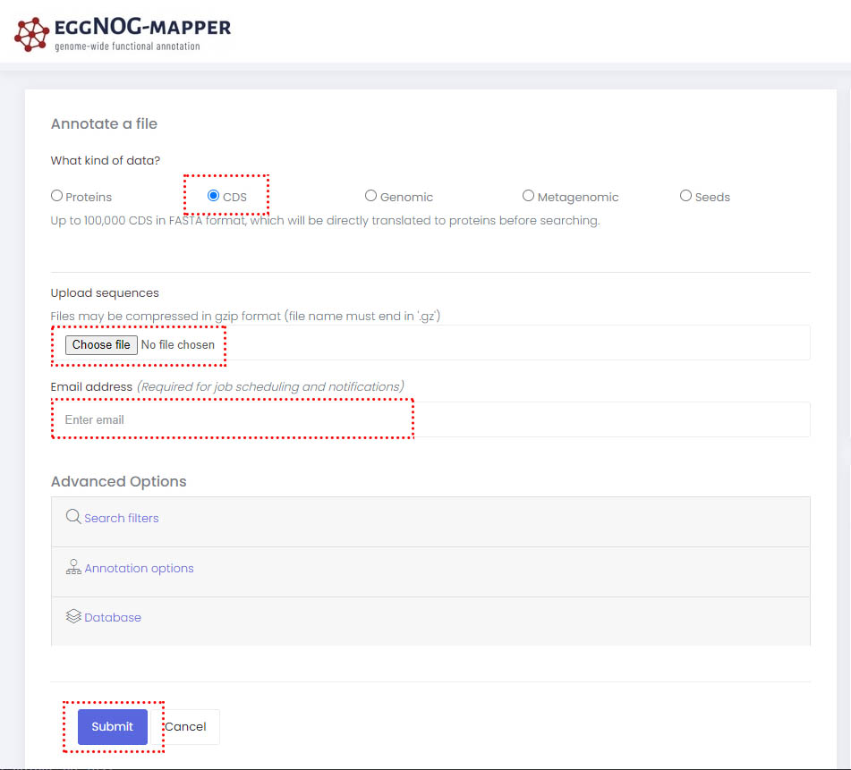
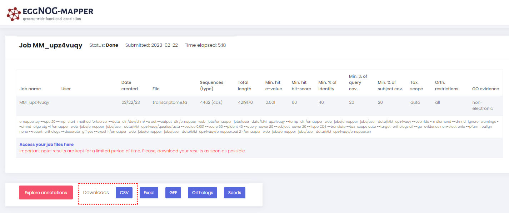
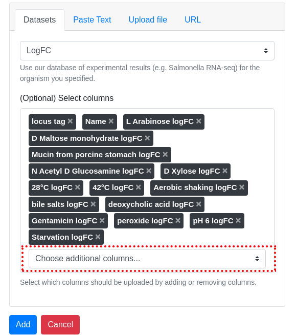
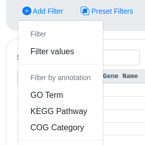

# Micromix user guide

## Contents
- [Micromix](README.md#micromix-user-guide)
- [Installing and running](installing_running.md#micromix-user-guide)
    - [Using pre-built AWS container](installing_running.md#1-using-pre-built-aws-container)
    - [Local install](installing_running.md#2-running-locally-or-on-a-server)
        - [Website](installing_running.md#website)
        - [Heatmap](installing_running.md#heatmap)
- [Using Micromix](using_micromix.md#micromix-user-guide)
    - [Selecting organism](using_micromix.md#selecting-organism)
    - [Filtering data](using_micromix.md#filtering-data)
    - [Visualising data](using_micromix.md#visualising-data)  
- [Modifying Micromix](modifying_micromix.md#micromix-user-guide)
    - [Preparing a new bacteria](modifying_micromix.md#preparing-a-new-bacteria)
    - [How to add a new organism](modifying_micromix.md#how-to-add-a-new-organism)
    - [How to add new expression data](modifying_micromix.md#how-to-add-new-expression-data)
    - [Modifying or adding gene or pathway annotations](modifying_micromix.md#modifying-or-adding-gene-or-pathway-annotations)
    - [Adding new visualisation plugins](modifying_micromix.md#adding-new-visualisation-plugins)


<br><br>

# Modifying Micromix

Depending on the way you have configured or downloaded Micromix, when making changes, the frontend or backend (or both) may require restarting before the changes are visable.

If using the pre-configured image, you can do this by pressing `Control + C` to stop the service in the relevant terminal.

```bash
#You can then re-run the required service

#To start the website
./run_website.sh

#To start the heatmap
./run_heatmap.sh

```

> If you have pre-compiled yourself, you only need to press `Control + C` to stop the service in the relevant terminal, then press the up arrow to find the previous command, followed by `Enter`.


## Preparing a new bacteria

Micromix can be used with any desired bacteria. Once a bacteria has been chosen, you will need to download and prepare some common files.
Here is a brief summary:

**Step 1:** Download files

**Step 2:** Create transcriptome

**Step 3:** Create eggNOG annotations

**Step 4:** Run script to generate .json files for Micromix

<br>

> In this example, we will use `Salmonella typhimurium SL1344`

<br>

### **Step 1:**

Download the genome (.fasta or .fa) and genome annotation (.gff or .gtf).

For this example, you can use the following:

```bash
#GFF
curl https://ftp.ensemblgenomes.ebi.ac.uk/pub/bacteria/release-56/gff3/bacteria_79_collection/salmonella_enterica_subsp_enterica_serovar_typhimurium_str_sl1344_gca_000210855/Salmonella_enterica_subsp_enterica_serovar_typhimurium_str_sl1344_gca_000210855.ASM21085v2.56.chromosome.Chromosome.gff3.gz -o salmonella_sl1344.gff3.gz

#Fasta
curl https://ftp.ensemblgenomes.ebi.ac.uk/pub/bacteria/release-56/fasta/bacteria_79_collection/salmonella_enterica_subsp_enterica_serovar_typhimurium_str_sl1344_gca_000210855/dna/Salmonella_enterica_subsp_enterica_serovar_typhimurium_str_sl1344_gca_000210855.ASM21085v2.dna.chromosome.Chromosome.fa.gz -o salmonella_sl1344.fa.gz

#unzip
gunzip salmonella_sl1344.gff3.gz
gunzip salmonella_sl1344.fa.gz
```

### **Step 2:**

Generate a bacterial transcriptome. This is required to upload to [eggNOG-mapper](http://eggnog-mapper.embl.de/), which will provide annotations, including gene description, KEGG pathways, Gene Ontologies etc.

To get a summary of the features within your .gff file, you can run this command:

```bash
awk -F '\t' '{print $3}' salmonella_sl1344.gff3 | sort | uniq -c
```

This will display something similar to this:

```bash
awk -F '\t' '{print $3}' salmonella_sl1344.gff3 | sort | uniq -c
   4622 
    129 biological_region
   4466 CDS
      1 chromosome
   4636 exon
   4462 gene
   4462 mRNA
    113 ncRNA
    113 ncRNA_gene
     40 pseudogene
     40 pseudogenic_transcript
```

To generate the transcriptome, you need to decide which features to use. For example, we may only want to look at CDS regions, or we may want to look at a wider range of features as shown:

```bash
#The generate_transcriptome.py script is located here:
/scripts/generate_transcriptome.py

#To view the help menu
./generate_transcriptome.py -h

#If available, we recommend using a tag that exists for each loci such as a locus tag (sl1344_0001), 
#so un-named and hypothetical genes will be included. 
#You will need to manually open the .gff file to identify what fields are available (alternatives are gene_id, ID, Name etc).

#To run, select the feature (CDS etc), and also the gene ID type. 
generate_transcriptome.py \
-fasta salmonella_sl1344.fa \
-gff salmonella_sl1344.gff3 \
-f ["CDS", "ncRNA", "pseudogene"] -a gene_id \
-o salmonella_sl1344.fa
```

> Note: Bacterial genome annotations (.gff/.gtf) can be challenging to work with due to non-uniformity, duplicate gene names and many other issues. You may receive an error message saying that some genes are duplicated, and thus a transcriptome couldn't be created. If this happens, open the .gff file and manually change the locus_tags or gene identifier you have chosen. For example, if there are multiple SL1344_0010, change to SL1344_0010a and SL1344_0010b, then re-run.

### **Step 3:**

You can now upload your transcriptome to eggNOG by browsing to [eggNOG-mapper](http://eggnog-mapper.embl.de/) . Select **CDS** as shown, then upload your transcriptome **upload sequences**.
Enter your **email address** and **submit** the job. You will receive an email that you need to click on, which will take you back to their site where you can start your job **Start job**.



After a short time, you will receive another email providing a download link. This will take you back to their site where you can download the annotation files that will be used in the next step. **Please download as a .csv**




### **Step 4:**

The last step is extracting out the required information from the eggNOG output and saving to a compatible format for Micromix (.json files)

To do this, you will need to run the following

```bash
#The script is located here 
/scripts/parse_eggnog_annotations.R

#R will need to be installed on your machine for this to execute successfully

#When running, you need to provide the eggNOG annotation file as shown
#The resulting output files will be saved in the current directory
./Rscript parse_eggnog_annotations.R eggnog_annotations.csv

#After running, you should have the following two new files:
gene_annotations.json
pathways.json
```

> The script `parse_eggnog_annotations.R` can be modified to extract and link additional functional annotations, currently it only extracts GO and KEGG IDs linking pathway names with these IDs. If required, you will need to find an R package or API that can provide the description of the interested IDs. 

<br>

## How to add a new organism

If you are adding a new organism, you will need to add a new entry to `datasets.json` 

If you are modifying an existing bacteria/organism, there should already be an entry, which no action is required 

```
b-theta/website/frontend/src/assets/json/organisms.json
```

Here as an example we have added **Bacteria B**:

```json
{
  "items": {

    "Bacteria A": {
      "name": "Bacteria A",
      "description": "Manually select datasets.",
      "path": "/bacteriaA",
      "id": "bacteria-a-e2ad6b25-40cb-4594-8685-f4fcb3ceb0e7",
      "datasets": ["Bacteria A RNA-seq"]
    },
    "Bacteria B": {
      "name": "Bacteria B",
      "description": "Manually select datasets.",
      "path": "/BacteriaB",
      "id": "bacteria-b-e2ad6b25-40cb-4594-8685-f4fcb3ceb0e8",
      "datasets": ["Bacteria B RNA-seq"]
    }
  }
}
```

**Description of the tags:**

`"name":` - The name of the bacteria (displayed on button)

`"description":` - The description (displayed on button)

`"path":` - This path automatically points to `b-theta/website/frontend/src/assets/organisms/`. This is where the majority of configuration files are stored for each bacteria within the site. For each new bacteria that is added, you should browse to this location and copy either the default folder or an existing bacterial folder and rename to your new bacterial name. In this example, the entire default folder should be copied and re-named to BacteriaB. Within this newly renamed folder is an icon you can choose to update, which is displayed on the button. You can also adit the file `filters.json` to add/modify/create custom filters (discussed below in more detail in the section [Modifying or adding gene or pathway annotations](modifying_micromix.md#modifying-or-adding-gene-or-pathway-annotations).

`"id":` - this is a string and hex numbers that should be unique for each bacteria

`"datasets":` - should link to an entry in this file: `b-theta/website/frontend/src/assets/json/datasets.json` (see below). 

> After adding new organism, you will need to link it to the  expression data - see the next section

<br>

## How to add new expression data

Although the heading mentions expression data, data from other next generation sequencing (NGS) approaches can be used. For example, proteomics data, genome data etc.

Once the expression (or relevant) files have been generated, they should be saved here:

```
b-theta/website/backend/static/
```

The corresponding file should then be added as an entry to datasets.json

```
b-theta/website/frontend/src/assets/json/datasets.json

```

Each new entry requires all the fields presented here, such as `text`, `value` and `separator`. The new entry here is called **New dataset** and is linked to the file **new_data.tsv** that should have previously been saved.

```json
{
  "Bacteria A RNA-seq": {
    "label": "Bacteria A RNA-seq",
    "options": [
      {
        "text": "Dataset 1",
        "value": {"filename": "dataset1.tsv", 
                  "seperator": "\t", 
                  "decimal_character": ".", 
                  "columns": [{"value": null, "text": "All columns"}, "Sequence name", "locus tag", "Name", "Start", "End", "Strand", "Condition 1 logFC", "Condition 2 logFC"]},
        "seperator": "\t"
      },
      {
        "text": "New dataset",
        "value": {"filename": "new_data.tsv", 
                  "seperator": "\t", 
                  "decimal_character": ".", 
                  "columns": [{"value": null, "text": "All columns"}, "Sequence name", "locus tag", "Name" "Start", "End", "Strand", "Condition 1 logFC"], 
                  "pre_selected_columns": ["locus tag", "Name", "Condition 1 logFC"]},
        "seperator": "\t"
      }

    ]
  }
}
```

Here is a brief description of the file contents:

`"Bacteria A RNA-seq":` - The is the bold value that cannot be selected in the dropdown menu when selecting a new dataset


`"text": "Dataset 1" ` and `"text": "New dataset" ` - these are the names that will appear in the dropdown box that when selected will load the corresponding expression data

`"value": ` - this contains the filename with the expression data, the delimiter and decimal character. 

The `columns` field should contain all columns within the associated file. If the column names do not match, an error will occur.

> If you would not like to immediately show all columns, you can decide which columns should initially be displayed with `pre_selected_columns`. They can be re-added by the user when selecting the data and selecting `choose additional columns...`.  



> After adding new expression data, both the frontend and backend will require a restart

<br>

## Modifying or adding gene or pathway annotations

There can be up to four files that may need to be edited, depending on requirements.

```bash
#Files associated with gene annotations and pathways

#Frontend - bacteria specific
Src/assets/organisms/<bacteria>/pathways.json
Src/assets/organisms/<bacteria>/filters.json

#Frontend - 
Src/components/search_query.vue

#Backend
Static/gene_annotations.json
```

### Gene annotations

Each gene should have a unique identifier, as seen below with BT_0001, BT0002 etc. Depending on the functional annotations that have been extracted, they will be linked and displayed in this file: `gene_annotations.json`. If additional functional annotations are required, they can be added to the script inthe previous section (above), or if specific classifications or categories are required, they can be added manually.

> If you have more then one organism loaded in the site, all genes should be present in this file 

An example of `gene_annotations.json`

```json
{
    "BT_0001": {
        "go_id": [
            "GO:0003872",
            "GO:0005524"
        ],
        "kegg_pathway_id": [
            "bth00010"
        ]
    },
    "BT_0002": {
        "go_id": [
            "GO:0004148",
            "GO:0045454",
            "GO:0050660"
        ],
        "kegg_pathway_id": [
            "bth00010",
            "bth00020",
            "bth00260"
        ]
    }
}
```

### Pathway annotations

All pathway annotations should be linked to each organism/bacteria and their specific genes. For this reason, the underlying pathways are stored within each bacteria's folder. For example:
```bash
#Bacteria A
Website/frontend/src/assets/organisms/bacteriaA/pathways.json

#Baceria B
Website/frontend/src/assets/organisms/bacteriaB/pathways.json
```

Ideally, these files are automatically generated from a script, as they can be quite large and detailed.    

A snippet of pathways.json, showing the first two GO and KEGG entries
```json
{
    "go": [
        {
            "id": "GO:0003674",
            "name": "molecular_function (GO:0003674)"
        },
        {
            "id": "GO:0005575",
            "name": "cellular_component (GO:0005575)"
        }
        ],
        "kegg": [
        {
            "id": "bth00010",
            "name": "Glycolysis / Gluconeogenesis (bth00010)"
        },
        {
            "id": "bth00020",
            "name": "Citrate cycle (TCA cycle) (bth00020)"
        }
        ]
    }
```

### Linking functional annotations to the site

Finally, to link the annotations so they can be loaded on the site and filtered, two files need to modified.

```bash
#1) The filters for each bacteria
#Bacteria A
Website/frontend/src/assets/organisms/bacteriaA/filters.json

#Baceria B
Website/frontend/src/assets/organisms/bacteriaB/filters.json

#2) Loading the filters
Website/frontend/src/components/search_query.vue

```

**1) Filters for each bacteria**

Each bacteria is required to have its unique set of filters. This can be a direct copy across multiple bacteria, but separate files are required. Within `filters.json`, you can setup and modify all available filters.  

**2) Loading the filters**

The last setp is linking all the existing information we have created/modified in the above steps into the site. This file is stored here:
```bash
Website/frontend/src/components/search_query.vue

#Loading functional annotations is achieved from the function
load_autocomplete_json()
#This should be lines 335-348 (shown below)
```

```javascript
load_autocomplete_json() {
    this.filters.items.templates["Filter by annotation"]["GO Term"].items.filter_annotation.source.items = this.pathways.go;
    this.filters.items.templates["Filter by annotation"]["KEGG Pathway"].items.filter_annotation.source.items = this.pathways.kegg;
},
```
Each element specificaly refers to particular files and filters.

**this.filters.items.templates** 

Only one bacteria can be displayed on the site at once, the site will only load the filters for that organism/bacteria - this part of the code points to the active organism/bacteria

**["Filter by annotation"]** 

This is the overarching filter name that all functional annotations are stored under in the file `Website/frontend/src/assets/organisms/bacteriaA/filters.json`

For example, in the below snippet, all filter starting with GO and stored under **Filter by annotation** :

```json
 "functional": {
      "Filter by annotation": {
        "GO Terms": {
          "properties": {
            "type": "filter",
            "query": "annotation_code",
            "code_type": "go_id"
          },
          "items": {
            "filter_annotation": {
...
```


**["GO Term"].items.filter_annotation.source.items**

"GO Term" will be the name displayed in the dropdown box on the site, and the remaining part of the code loads the filter default values that are contained within `filters.json`.



**= this.pathways.go;**

Links to the `pathways.json` file and searches for all the entries under the parent term **go**. The names here need to match exactly. This tells the site to load all the GO entries and make them available for searching when GO Terms is selected. Likewise for other pathways of interest, you will need to add in additional lines to `search_query.vue` and link to the correct sections of the corresponding elements of the linked files.

<br>

## Adding new visualisation plugins

**<< work in progress >>**

Buttons can do many things,

 - Link to a different API - clustergrammer
 - Link to website - jbrowse
 - Link to a custom API - heatmap

Info stored in [  ] and should be assigned a unique HEX number, such as xxx.

Each plugin is stored in [  ]. Open the corresponding files to examine how information is parsed.


## How to deploy on a server and config files – nginx and gunicorn

**<< work in progress >>**


