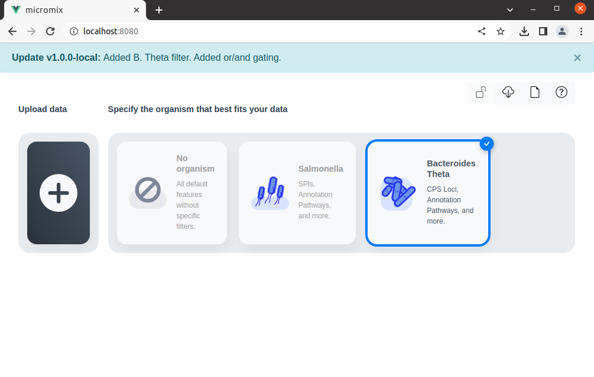
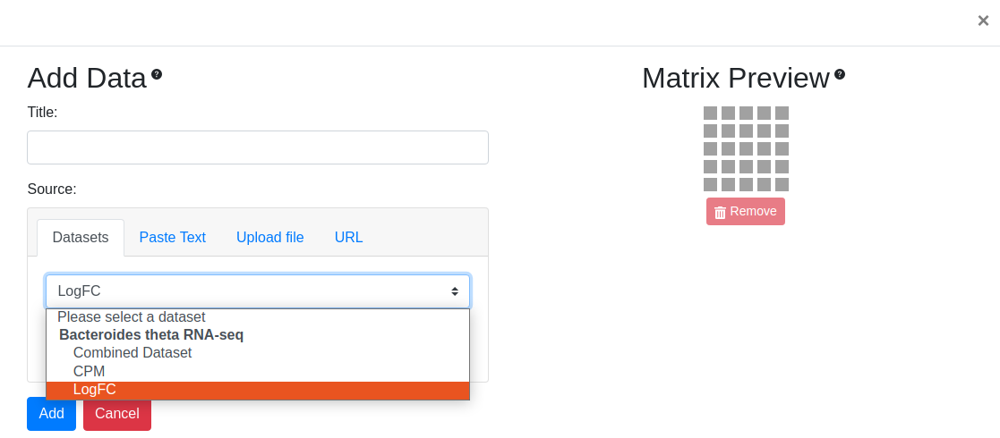
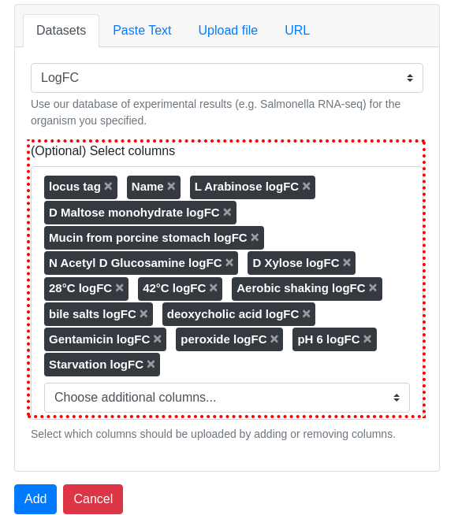
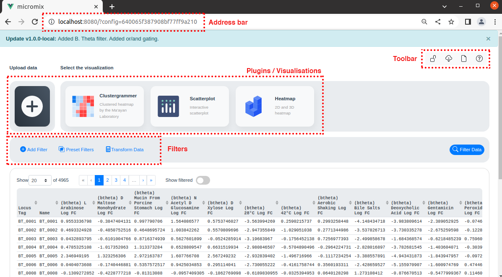
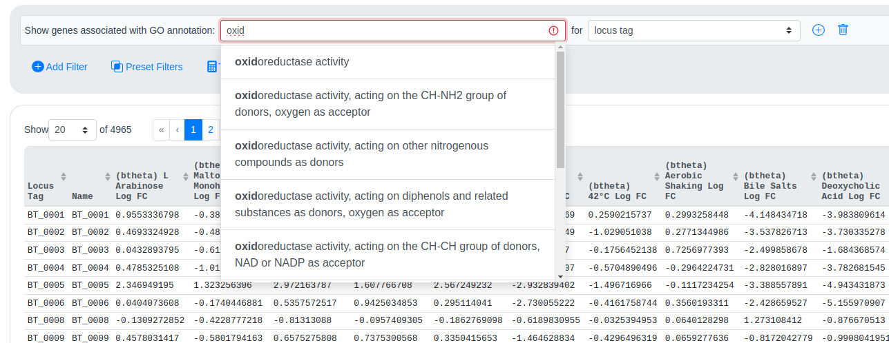
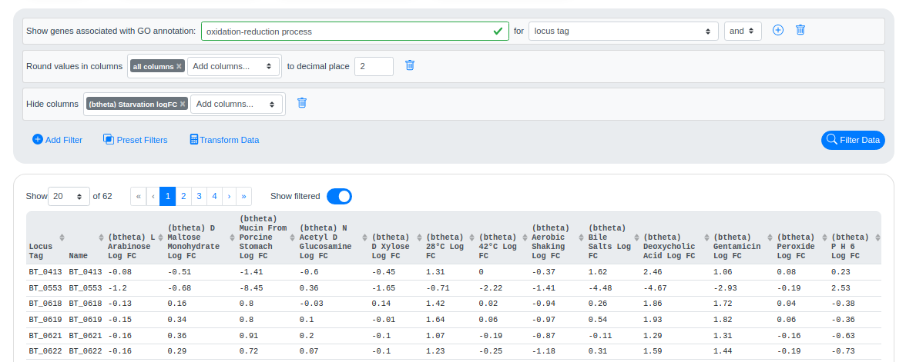
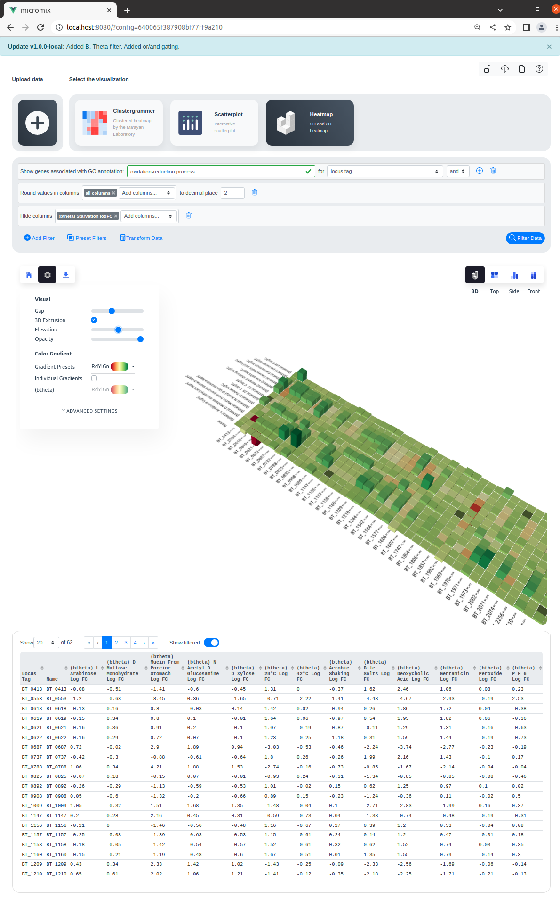
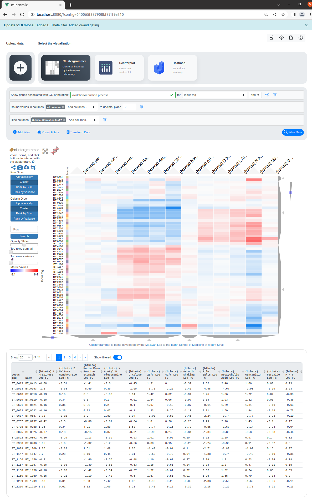

# Micromix user guide

## Contents
- [Micromix](README.md#micromix-user-guide)
- [Installing and running](installing_running.md#micromix-user-guide)
    - [Using pre-built AWS container](installing_running.md#1-using-pre-built-aws-container)
    - [Local install](installing_running.md#2-running-locally-or-on-a-server)
        - [Website](installing_running.md#website)
        - [Heatmap](installing_running.md#heatmap)
- [Using Micromix](using_micromix.md#micromix-user-guide)
    - [Selecting organism](using_micromix.md#selecting-organism)
    - [Filtering data](using_micromix.md#filtering-data)
    - [Visualising data](using_micromix.md#visualising-data)  
- [Modifying Micromix](modifying_micromix.md#micromix-user-guide)
    - [Preparing a new bacteria](modifying_micromix.md#preparing-a-new-bacteria)
    - [How to add a new organism](modifying_micromix.md#how-to-add-a-new-organism)
    - [How to add new expression data](modifying_micromix.md#how-to-add-new-expression-data)
    - [Modifying or adding gene or pathway annotations](modifying_micromix.md#modifying-or-adding-gene-or-pathway-annotations)
    - [Adding new visualisation plugins](modifying_micromix.md#adding-new-visualisation-plugins)

  

# Using Micromix

This is a brief guide for highlighting the functionality of the Micromix website. 

The site was developed to be adaptable for use with multiple organisms and datasets, with the resulting data to be viewed through available plugins. New organisms/datasets can be added or removed as required - and plugins can be designed and added for additional visualisation options.

## Selecting organism

The first page allows you to select one of the available organisms/bacteria. 

Once chosen, you have the option of selecting the desired datasets.

You can also choose to load in custom data from other sources such as delimited file or URL

You also have the choice of adding or removing specific columns.

Clicking **Add** will load the data

The above image shows main elements of the site once data has been added. 

### Address bar:

Each time new data is selected, a new database entry is added and assigned a unique ID. This configuration ID is added to the address bar and links the current session, storing any data transformations, filtering and visualisations. This becomes useful when revisiting the site and instead of re-loading data and applying filters, the config ID can be pasted into the address bar and the existing session will be restored. This link can also be shared with collaborators, providing an easy way to share interesting results or observations.

### Toolbar:

On the top right of the website there is a toolbar with four buttons. 

 - The **padlock button** locks the current state of the site so no further edits can be made. This would be useful when sending to a collaborator or if wanting to include a URL within a manuscript or similar document. 
 - The **download button** allows users to download the currently selected dataset as an Excel or a delimited file (such as .csv). 
 - The **new document button** will re-load the website so a new dataset can be selected. 
 - The **help button** when clicked will provide pop-over text explaining various features of the site.

### Plugins / visualisations:

This is where the data visualisation plugins are loaded as separate buttons. Each plugin when clicked will allow the user to visualise their data. Additional plugins can be created and added. For details on how to add new plugins, see [Adding new visualisation plugins](modifying_micromix.md#adding-new-visualisation-plugins) 

### Filters:

Standard filters exist allowing functional annotations to be searched, such as Gene Ontology (GO) and KEGG IDs - these are available under **Add Filter**. Custom gene lists such as virulence factors/ncRNA etc can also be added to select genes of interest - these are available under **Preset Filters**. Values within the table can also be modified, such as converting to Log, or displaying certain nummber of decimal places - these are available under **Transform Data**. 

 

## Filtering data

As discussed above, there is the option of filtering the entire list of genes into categories of interest.

 - The functional annotation filters allow you to type the beginning of a category/pathway and the closest matches appear in the dropdown menu (although only 10 are initially visible, additional categories/pathways can be viewed by scrolling). Functional annotations and filters can be modified as described here: [Modifying or adding gene or pathway annotations](modifying_micromix.md#modifying-or-adding-gene-or-pathway-annotations)

 - Filters can either be a singular, or chained together

 

## Visualising data

There are currently 3 visualisation plugins available, Heatmap, Clustergrammer and Scatterplot.

### Heatmap

This is the heatmap that is required to be run alongside the website. It was designed with WebGL, providing 3D and 2D views of the resulting data. The visualisation options are highly customisable and it also provides an option to export the heatmap as an image. An advantage of this plugin is its speed and ability to easily visualise many genes and samples.

If the heatmap is not working, you may need to make sure it has been deployed correctly - see [Heatmap](installing_running.md#heatmap)

### Clustergrammer

The Clustergrammer plugin utalises the API from the Ma'ayan lab, passing the requested data and returning an interractive heatmap. Here you can utalise features such as row and column clustering, as well as exporting the heatmap as an image. 

> It should be noted that < 200 genes should be used for visualisations (an in-built restriction built into the API), otherwise an error may occur. If you require larger datasets, there is an option of deploying your own [Clustergrammer server](https://maayanlab.cloud/clustergrammer/) 

### Scatterplot

**<< TBD >>**

Hannah, I'm unsure if this will be kept in the final version - curious to know if you find the scatterplot useful?
